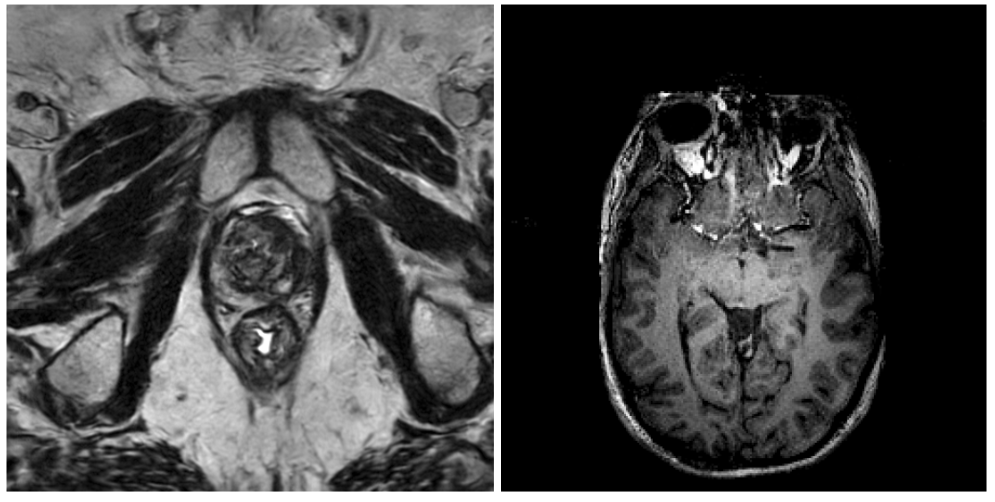

# NV-Generate-CTMR

[](LICENSE)
[](https://huggingface.co/nvidia/NV-Generate-CT)
[](https://huggingface.co/nvidia/NV-Generate-MR)
[](https://huggingface.co/nvidia/NV-Generate-MR-Brain)
[](https://arxiv.org/abs/2409.11169)
[](https://arxiv.org/abs/2508.05772)
[](https://www.python.org/)

3D Latent Diffusion Models (LDM) for generating large CT and MRI images with corresponding segmentation masks. Supports variable volume size and voxel spacing with precise control of organ/tumor size.

Please cite all the following papers if you are using code or model from this repo.

- [MAISI-v1 Paper (WACV 2025)](https://arxiv.org/pdf/2409.11169)
- [MAISI-v2 Paper (AAAI 2026)](https://arxiv.org/pdf/2508.05772)

| | | |
|:---:|:---:|:---:|
||  |  |
|*Generated MR Brain with `rflow-mr-brain`*| *Generated MR T2w prostate and T1w brain image with  with `rflow-mr`* | *Generated CT image/mask pair with  with `rflow-ct`* |

## Overview

NV-Generate-CTMR generates high-resolution synthetic 3D medical volumes using latent diffusion models built on the MAISI (Medical AI for Synthetic Imaging) framework. It produces CT images with paired segmentation masks and MRI volumes across multiple contrasts — enabling synthetic training data generation, data augmentation for rare pathologies, and privacy-preserving data sharing.

Key capabilities:

- **CT generation** with paired 132-class segmentation masks, supporting volumes up to 512x512x768 voxels with controllable organ and tumor size
- **MRI generation** across T1, T2, FLAIR, and additional contrasts for brain, abdomen, breast, and prostate anatomy
- **Brain MRI synthesis** with cross-sequence ControlNet for generating matched multi-contrast brain volumes (T1w, T2w, FLAIR, SWI)
- **Variable resolution** with configurable volume size and voxel spacing for each generation

**[Live Demo](https://build.nvidia.com/nvidia/maisi)** (no GPU required)

## News

- **🎆 March 2026 🎇** — Released NV-Generate-MR-Brain v0 models `rflow-mr-brain` for fast high-resolution 3D MR brain image generation, which covers both whole brain and skull-stripped brain generation for T1w, T2w, FLAIR, SWI images. The training data of this version v0 is [MR-RATE](https://huggingface.co/datasets/Forithmus/MR-RATE).
- **[October 2025]** — Released rectified flow models `rflow-mr` for fast high-resolution 3D MR image generation. Upgraded previous MAISI
repo to this NV-Generate-CTMR repo.
- **[March 2025]** — Released rectified flow models `rflow-ct` for **fast** high-resolution 3D CT image generation and paired CT
image/mask synthesis. `rflow-ct` is **33x faster** than `ddpm-ct` and generates better quality images for the head region and small
output volumes.
- **[August 2024]** — Initial release `ddpm-ct` supporting 3D latent diffusion (DDPM) for CT image generation and paired CT image/mask
synthesis.

## Table of Contents

- [Overview](#overview)
- [News](#news)
- [1. Model Variants](#1-model-variants)
- [2. Quick Start](#2-quick-start-requires-at-least-a-16g-gpu)
  - [2.1 Installation](#21-installation)
  - [2.2 MR Brain Image Generation](#22-mr-brain-image-generation)
  - [2.3 CT Paired Image/Mask Generation](#23-ct-paired-imagemask-generation)
  - [2.4 CT Image Generation](#24-ct-image-generation)
  - [2.5 MR Image Generation](#25-mr-image-generation)
  - [2.6 CT Image Generation from Your Own Mask](#26-ct-image-generation-from-your-own-mask)
  - [2.7 Example Application: MR-to-CT Image Synthesis](#27-example-application-adapting-nv-generate-ctmr-for-mr-to-ct-image-synthesis)
- [3. Documentation: details of data preparation, training, and inference tutorials](#3-documentation-details-of-data-preparation-training-and-inference-tutorials)
- [4. Performance: accuracy, speed, and GPU memory usage](#4-performance-accuracy-speed-and-gpu-memory-usage)
- [5. License](#5-license)
- [6. Citation](#6-citation)
- [7. Resources](#7-resources)
- [8. Acknowledgements](#8-acknowledgements)

## 1. Model Variants

This repository provides **four model variants** for medical image generation: `rflow-mr-brain`, `rflow-mr`, `rflow-ct`, and `ddpm-ct`.

| | `rflow-mr-brain` | `rflow-mr` | `rflow-ct` | `ddpm-ct` |
|---|---|---|---|---|
| **Modality** | MRI (Brain) | MRI | CT | CT |
| **Model Weights** | [NV-Generate-MR-Brain](https://huggingface.co/nvidia/NV-Generate-MR-Brain) | [NV-Generate-MR](https://huggingface.co/nvidia/NV-Generate-MR) | [NV-Generate-CT](https://huggingface.co/nvidia/NV-Generate-CT) | [NV-Generate-CT](https://huggingface.co/nvidia/NV-Generate-CT) |
| **Architecture** | MAISI-v2 (Rectified Flow) | MAISI-v2 (Rectified Flow) | MAISI-v2 (Rectified Flow) | MAISI-v1 (DDPM) |
| **Paper** | [MAISI-v2](https://arxiv.org/abs/2508.05772) | [MAISI-v2](https://arxiv.org/abs/2508.05772) | [MAISI-v2](https://arxiv.org/abs/2508.05772) | [MAISI-v1](https://arxiv.org/abs/2409.11169) |
| **Inference Steps** | 30 | 30 | 30 | 1000 |
| **Max Volume** | 512x512x256 | 512x512x128 | 512x512x768 | 512x512x768 |
| **Use Case** | MR Brain multi-contrast synthesis | MR image-only generation | CT image/mask pair generation | CT image/mask pair generation |
| **License** | [NVIDIA Open Model](https://www.nvidia.com/en-us/agreements/enterprise-software/nvidia-open-model-license/) | [NVIDIA Non-Commercial](https://developer.download.nvidia.com/licenses/NVIDIA-OneWay-Noncommercial-License-22Mar2022.pdf) | [NVIDIA Open Model](https://www.nvidia.com/en-us/agreements/enterprise-software/nvidia-open-model-license/) | [NVIDIA Open Model](https://www.nvidia.com/en-us/agreements/enterprise-software/nvidia-open-model-license/) |

**Summary**: Use `rflow-ct` for CT (whole-body inference). Use `rflow-mr-brain` for brain MRI (multi-contrast). Use `rflow-mr` for other MRI anatomies (fine-tune on your own data).

### Detailed comparison

|                    | `rflow-mr-brain`     | `rflow-mr`                          | `rflow-ct`                        | `ddpm-ct`             |
|--------------------|---------------------|--------------------------------------|-----------------------------------|----------------------|
| **Modality**       | MRI (brain)         | MRI                                  | CT                                | CT                   |
| **Release Date**   | **March 2026**       | October 2025                           |  March 2025                     |    August 2024        |
| **Model Weights**  | [NV-Generate-MR-Brain](https://huggingface.co/nvidia/NV-Generate-MR-Brain) | [NV-Generate-MR](https://huggingface.co/nvidia/NV-Generate-MR) | [NV-Generate-CT](https://huggingface.co/nvidia/NV-Generate-CT) | [NV-Generate-CT](https://huggingface.co/nvidia/NV-Generate-CT) |
| **Quick Start**    | [2.2 MR Brain Image Generation](#22-mr-brain-image-generation) | [2.5 MR Image Generation](#25-mr-image-generation) | [2.3 CT Paired Image/Mask](#23-ct-paired-imagemask-generation), [2.4 CT Image](#24-ct-image-generation) | [2.3 CT Paired Image/Mask](#23-ct-paired-imagemask-generation) |
| **Architecture**   | MAISI-v2 (Rectified Flow) | MAISI-v2 (Rectified Flow)            | MAISI-v2 (Rectified Flow)         | MAISI-v1 (DDPM)      |
| **Paper**          | [MAISI-v2](https://arxiv.org/abs/2508.05772) | [MAISI-v2](https://arxiv.org/abs/2508.05772) | [MAISI-v2](https://arxiv.org/abs/2508.05772) | [MAISI-v1](https://arxiv.org/abs/2409.11169) |
| **Network Detail** | [config_network_rflow.json](./configs/config_network_rflow.json) | [config_network_rflow.json](./configs/config_network_rflow.json) | [config_network_rflow.json](./configs/config_network_rflow.json) | [config_network_ddpm.json](./configs/config_network_ddpm.json) |
| **Inference Steps**| 30                  | 30                                    | 30 (**33× faster than `ddpm-ct`**)               | 1000                 |
| **Max Volume**     | 512×512×256         | 512×512×128                           | 512×512×768                       | 512×512×768          |
| **Use Case**       | MR image-only generation for brain (T1w, T2w, FLAIR, SWI; whole brain and skull-stripped) | MR image-only generation with user specified contrast | CT image-only generation; CT image/mask pair generation | CT image-only generation; CT image/mask pair generation |
| **Model: Foundation VAE**     | same VAE with `ddpm-ct` | trained on CT and MR (with additional abdomen MRI) | same VAE with `ddpm-ct` | trained on CT and MR |
| **Model: Foundation Diffusion Model**     | does not take body region as input, takes [modality](configs/modality_mapping.json) as input (brain-focused) | does not take body region as input, takes [modality](configs/modality_mapping.json) as input. We recommend finetuning with users' own MRI data. | does not take body region as input, has API for modality input (always set as 'ct' but expandable) | takes body region as input, no API for modality input  |
| **Model: ControlNet**     | Coming soon | N/A | generate image/mask pairs, with contrastive loss | generate image/mask pairs, no contrastive loss |

## 2. Quick Start (requires at least a 16G GPU)

> ⚠️ **Picking the right `dim` and `spacing` is the single biggest factor in output quality.** The product `dim × spacing` defines the field of view (FOV). Each model variant has only ever seen FOVs in the **training-data distribution** for its target anatomy — asking it to synthesize at a numerically-valid but out-of-distribution FOV (e.g. a 128 mm-cube whole-body CT) produces unusable output. Start from the recommended `(dim, spacing)` per anatomy:
>
> - **CT** (`rflow-ct`, `ddpm-ct`): [docs/inference.md#recommended-spacing-for-ct](docs/inference.md#recommended-spacing-for-ct)
> - **MR** (`rflow-mr`): [docs/inference.md#recommended-fov-for-mr-rflow-mr-model](docs/inference.md#recommended-fov-for-mr-rflow-mr-model)
>
> See also the `infer_image-only` / `infer_mask-image-paired` skills under [skills/](skills/) for end-to-end workflow guidance.

### 2.1 Installation

```bash
pip install -r requirements.txt
```

### 2.2 MR Brain Image Generation

Please refer to [inference_diff_unet_tutorial.ipynb](inference_diff_unet_tutorial.ipynb) for the inference tutorial that generates CT or MR image without mask.

You can also run it in command line to generate MR image without mask. Please change "modality" in [configs/config_maisi_diff_model_rflow-mr-brain.json](configs/config_maisi_diff_model_rflow-mr-brain.json) according to [configs/modality_mapping.json](configs/modality_mapping.json) to control the output MR contrast. Currently we support both whole brain and skull-stripped brain generation for T1w, T2w, FLAIR, SWI images.

```json
"mri":8, # MRI without specifying contrast or skull condition, can be any of them
"mri_t1":9, # T1w whole-brain MRI
"mri_t2":10, # T2w whole-brain MRI
"mri_flair":11, # FLAIR whole-brain MRI
"mri_swi":20, # SWI whole-brain MRI
"mri_t1_skull_stripped":29, # T1w skull-stripped brain MRI
"mri_t2_skull_stripped":30, # T2w skull-stripped brain MRI
"mri_flair_skull_stripped":31, # FLAIR skull-stripped brain MRI
"mri_swi_skull_stripped":32, # SWI skull-stripped brain MRI
```

```bash
network="rflow"
generate_version="rflow-mr-brain"
python -m scripts.download_model_data --version ${generate_version} --root_dir "./" --model_only
python -m scripts.diff_model_infer -t ./configs/config_network_${network}.json -e ./configs/environment_maisi_diff_model_${generate_version}.json -c ./configs/config_maisi_diff_model_${generate_version}.json
```

### 2.3 CT Paired Image/Mask Generation

```bash
export MONAI_DATA_DIRECTORY="./temp_work_dir"
network="rflow"
generate_version="rflow-ct" # can change to "ddpm-ct"
python -m scripts.inference -t ./configs/config_network_${network}.json -i ./configs/config_infer.json -e ./configs/environment_${generate_version}.json --random-seed 0 --version ${generate_version}
```

See also: [inference_tutorial.ipynb](inference_tutorial.ipynb)

### 2.4 CT Image Generation

```bash
network="rflow"
generate_version="rflow-ct" # can change to "ddpm-ct"
python -m scripts.download_model_data --version ${generate_version} --root_dir "./" --model_only
python -m scripts.diff_model_infer -t ./configs/config_network_${network}.json -e ./configs/environment_maisi_diff_model_${generate_version}.json -c ./configs/config_maisi_diff_model_${generate_version}.json
```

### 2.5 MR Image Generation

Change `"modality"` in [configs/config_maisi_diff_model_rflow-mr.json](configs/config_maisi_diff_model_rflow-mr.json) according to [configs/modality_mapping.json](configs/modality_mapping.json) to control the output MR contrast. Supported contrasts: T1/T2 brain, FLAIR skull-stripped brain, T2 prostate, T1 breast, T1/T2 abdomen. But if you are going to synthesize brain images, we recommend using `rflow-mr-brain` model instead. Please see [2.2 MR Brain Image Generation](#22-mr-brain-image-generation). Different body region has different recommended FOV, please see [detailed inference guide](./docs/inference.md#recommended-fov-for-mr-rflow-mr-model).

```bash
network="rflow"
generate_version="rflow-mr"
python -m scripts.download_model_data --version ${generate_version} --root_dir "./" --model_only
python -m scripts.diff_model_infer -t ./configs/config_network_${network}.json -e ./configs/environment_maisi_diff_model_${generate_version}.json -c ./configs/config_maisi_diff_model_${generate_version}.json
```

### 2.6 CT Image Generation from Your Own Mask

If you already have a 3D label mask in the **MAISI 132-class vocabulary** with the body envelope (label `200`) added, you can feed it directly to the CT ControlNet to synthesize a paired CT image — no mask diffusion step needed:

```bash
network="rflow"
generate_version="rflow-ct" # can change to "ddpm-ct"
python -m scripts.download_model_data --version ${generate_version} --root_dir "./"
python -m scripts.infer_image_from_mask \
  -t ./configs/config_network_${network}.json \
  -i ./configs/config_infer.json \
  -e ./configs/environment_${generate_version}.json \
  --mask /path/to/your_mask.nii.gz
```

> ⚠️ **The mask must be in the MAISI 132-class label vocabulary AND include the body envelope (label 200).** In concrete terms, the MAISI 132-class vocabulary is the same as the `nv-segment-ct` output label definition **plus the body envelope (label 200)**. The authoritative reference is [`configs/label_dict.json`](configs/label_dict.json). Two practical ways to produce a valid mask:
>
> - **From `nv-segment-ct`** (recommended — already in MAISI vocabulary): run `nv-segment-ct` on the CT, then add the body envelope via `scripts.utils.add_body_envelope` (label 200 is never emitted by `nv-segment-ct`).
> - **From another segmenter**: remap the output labels to the MAISI 132-class IDs in `configs/label_dict.json`, then add the body envelope.
>
> See the [`infer_image-from-mask` skill](skills/infer_image-from-mask.md) for the full preprocessing chain and the complete spec of "valid mask format".

For batch generation from many masks listed in a JSON, see [`scripts.infer_image_from_mask_batch`](scripts/infer_image_from_mask_batch.py).

### 2.7 Example Application: Adapting NV-Generate-CTMR for MR-to-CT Image Synthesis

A reference implementation for MR-to-CT synthesis based on NV-Generate-CTMR (rflow-ct) is available here: <https://github.com/brudfors/maisi-mr-to-ct>.

If you've adapted NV-Generate-CTMR for other imaging tasks or applications and would like to share your work, please feel free to open an issue or contact the maintainers — we'd love to link to your repo.

## 3. Documentation: details of data preparation, training, and inference tutorials

| Guide | Description |
|-------|-------------|
| [Setup](docs/setup.md) | Full installation guide, dependencies, model weight download |
| [Inference](docs/inference.md) | Detailed inference parameters, spacing tables |
| [Training](docs/training.md) | VAE, Diffusion Model, and ControlNet training guides |
| [Data Preparation](docs/data.md) | Dataset formats and preparation steps |
| [Evaluation](docs/evaluation.md) | FID evaluation tool and benchmark results |
| [Troubleshooting](docs/troubleshooting.md) | Common issues and solutions |
| [Applications](docs/applications.md) | Community adaptations (MR-to-CT synthesis) |
| [Inference Tutorial](inference_tutorial.ipynb) | Quick start CT paired generation (notebook) |
| [Diffusion Inference](inference_diff_unet_tutorial.ipynb) | CT/MR image-only generation (notebook) |
| [Training Tutorials](train_vae_tutorial.ipynb) | VAE, diffusion, and ControlNet training |

Training, inference, data preparation, and evaluation details are covered in the guides linked above.

## 4. Performance: accuracy, speed, and GPU memory usage

On the unseen [autoPET 2023](https://www.nature.com/articles/s41597-022-01718-3) benchmark:

| Model | FID Score | Inference Steps | Speed vs ddpm-ct |
|-------|----------|-----------------|------------------|
| `rflow-ct` | **5.124** | 30 | **33x faster** |
| `ddpm-ct` | 6.083 | 1000 | baseline |

For inference parameters, see [Documentation](#3-documentation-details-of-data-preparation-training-and-inference-tutorials). For GPU memory and timing, see [Performance](docs/performance.md).

## 5. License

| Component | License |
|-----------|---------|
| Source code | [Apache 2.0](LICENSE) |
| NV-Generate-CT weights | [NVIDIA Open Model](https://www.nvidia.com/en-us/agreements/enterprise-software/nvidia-open-model-license/) |
| NV-Generate-MR weights | [NVIDIA Non-Commercial](https://developer.download.nvidia.com/licenses/NVIDIA-OneWay-Noncommercial-License-22Mar2022.pdf) |
| NV-Generate-MR-Brain weights | [NVIDIA Open Model](https://www.nvidia.com/en-us/agreements/enterprise-software/nvidia-open-model-license/) |

This project will download and install additional third-party open source software projects. Review the license terms of these open source projects before use.

## 6. Citation

```bibtex
@article{zhao2026maisi,
  title={MAISI-v2: Accelerated 3D high-resolution medical image synthesis with rectified flow and region-specific contrastive loss},
  author={Zhao, Can and Guo, Pengfei and Yang, Dong and Tang, Yucheng and He, Yufan and Simon, Benjamin and Belue, Mason and Harmon, Stephanie and Turkbey, Baris and Xu, Daguang},
  journal={Proceedings of the 40th AAAI Conference on Artificial Intelligence (AAAI 2026)},
  year={2026}
}
```

```bibtex
@inproceedings{guo2025maisi,
  title={MAISI: Medical AI for synthetic imaging},
  author={Guo, Pengfei and Zhao, Can and Yang, Dong and Xu, Ziyue and Nath, Vishwesh and Tang, Yucheng and Simon, Benjamin and Belue, Mason and Harmon, Stephanie and Turkbey, Baris and others},
  booktitle={2025 IEEE/CVF Winter Conference on Applications of Computer Vision (WACV)},
  pages={4430--4441},
  year={2025},
  organization={IEEE}
}
```

## 7. Resources

- [NV-Generate-CT on HuggingFace](https://huggingface.co/nvidia/NV-Generate-CT) -- CT model weights and model card
- [NV-Generate-MR on HuggingFace](https://huggingface.co/nvidia/NV-Generate-MR) -- MR model weights and model card
- [NV-Generate-MR-Brain on HuggingFace](https://huggingface.co/nvidia/NV-Generate-MR-Brain) -- Brain MRI model weights and model card
- [MR-RATE on HuggingFace](https://huggingface.co/datasets/Forithmus/MR-RATE) -- Brain MRI model training data MR-RATE
- [MAISI Live Demo](https://build.nvidia.com/nvidia/maisi) -- Try online without GPU
- [MAISI-v1 Paper (WACV 2025)](https://arxiv.org/pdf/2409.11169)
- [MAISI-v2 Paper (AAAI 2026)](https://arxiv.org/pdf/2508.05772)
- Built with [MONAI](https://monai.io/) -- Medical Open Network for AI

## 8. Acknowledgements

This project was conducted by NVIDIA in collaboration with the University of Zurich, Istanbul Medipol University, and Forithmus.

We would like to thank the following people for their contributions to the development of the [NV-Generate-MR-Brain](https://huggingface.co/nvidia/NV-Generate-MR-Brain) models: Bjoern Menze, Ibrahim Ethem Hamamci, Sezgin Er, Suprosanna Shit, Utku Türkbey, etc.


