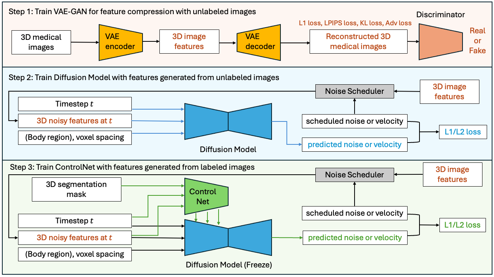
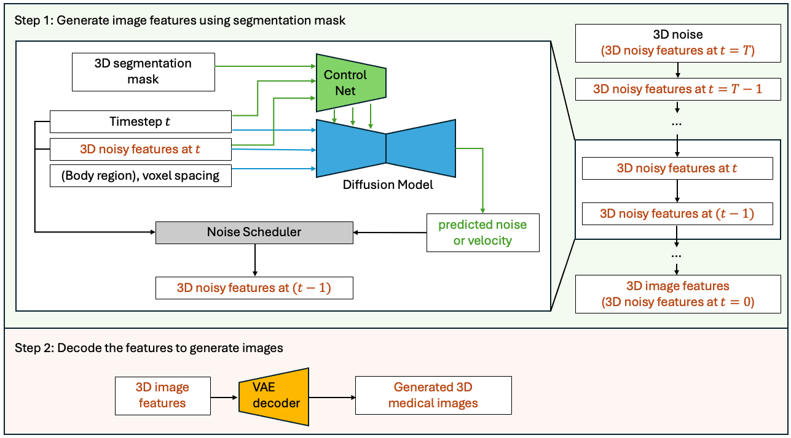

# Inference Guide

## Architecture

The pipeline trains an autoencoder in pixel space to encode images into latent features, then trains a diffusion model in the latent space. During inference, latent features are generated from random noise via denoising steps, then decoded by the autoencoder.





Network definitions: [config_network_rflow.json](../configs/config_network_rflow.json), [config_network_ddpm.json](../configs/config_network_ddpm.json). Key references: [Latent Diffusion (CVPR 2022)](https://openaccess.thecvf.com/content/CVPR2022/papers/Rombach_High-Resolution_Image_Synthesis_With_Latent_Diffusion_Models_CVPR_2022_paper.pdf), [ControlNet (ICCV 2023)](https://openaccess.thecvf.com/content/ICCV2023/papers/Zhang_Adding_Conditional_Control_to_Text-to-Image_Diffusion_Models_ICCV_2023_paper.pdf), [Rectified Flow (ICLR 2023)](https://arxiv.org/pdf/2209.03003).

## Overview

NV-Generate-CTMR supports several inference modes:

- **Paired CT image/mask generation** -- generates CT images with corresponding segmentation masks (using ControlNet)
- **CT image-only generation** -- generates CT images without masks
- **MR image-only generation** -- generates MR images with user-specified contrast

## Inference Parameters

The information for the inference input, such as the body region and anatomy to generate, is stored in [../configs/config_infer.json](../configs/config_infer.json). Feel free to experiment with it. Below are the details of the parameters:

- `"num_output_samples"`: An integer specifying the number of output image/mask pairs to generate.
- `"spacing"`: The voxel size of the generated images. For example, if set to `[1.5, 1.5, 2.0]`, it generates images with a resolution of 1.5x1.5x2.0 mm.
- `"output_size"`: The volume size of the generated images. For example, if set to `[512, 512, 256]`, it generates images of size 512x512x256. The values must be divisible by 16. If GPU memory is limited, adjust these to smaller numbers. Note that `"spacing"` and `"output_size"` together determine the output field of view (FOV). For example, if set to `[1.5, 1.5, 2.0]` mm and `[512, 512, 256]`, the FOV is 768x768x512 mm. We recommend the FOV in the x and y axes to be at least 256 mm for the head and at least 384 mm for other body regions like the abdomen. There is no restriction for the z-axis.
- `"controllable_anatomy_size"`: A list specifying controllable anatomy and their size scale (0-1). For example, if set to `[["liver", 0.5], ["hepatic tumor", 0.3]]`, the generated image will contain a liver of median size (around the 50th percentile) and a relatively small hepatic tumor (around the 30th percentile). The output will include paired images and segmentation masks for the controllable anatomy.
- `"body_region"`: For `maisi3d_rflow`, it is deprecated and can be set as `[]`. The output body region will be determined by `"anatomy_list"`. For `maisi3d_ddpm`, if `"controllable_anatomy_size"` is not specified, `"body_region"` will constrain the region of the generated images. It must be chosen from `"head"`, `"chest"`, `"thorax"`, `"abdomen"`, `"pelvis"`, or `"lower"`. Please set a reasonable `"body_region"` for the given FOV determined by `"spacing"` and `"output_size"`. For example, if FOV is only 128mm in z-axis, we should not expect `"body_region"` to contain all of [`"head"`, `"chest"`, `"thorax"`, `"abdomen"`, `"pelvis"`, `"lower"`].
- `"anatomy_list"`: If `"controllable_anatomy_size"` is not specified, the output will include paired images and segmentation masks for the anatomy listed in `"../configs/label_dict.json"`.
- `"autoencoder_sliding_window_infer_size"`: To save GPU memory, sliding window inference is used when decoding latents into images if `"output_size"` is large. This parameter specifies the patch size of the sliding window. Smaller values reduce GPU memory usage but increase the time cost. The values must be divisible by 16. If GPU memory is sufficient, select a larger value for this parameter.
- `"autoencoder_sliding_window_infer_overlap"`: A float between 0 and 1. Larger values reduce stitching artifacts when patches are stitched during sliding window inference but increase the time cost. If you do not observe seam lines in the generated image, you can use a smaller value to save inference time.
- `"autoencoder_tp_num_splits"`: An integer chosen from `[1, 2, 4, 8, 16]`. Tensor parallelism is used in the autoencoder to save GPU memory. Larger values reduce GPU memory usage. If GPU memory is sufficient, select a smaller value for this parameter.

## Recommended Spacing for CT

According to the statistics of the training data, we have recommended input parameters for the body region that are included in the training data.
The Recommended `"output_size"` is the median value of the training data, the Recommended `"spacing"` is the median FOV (the product of `"output_size"` and `"spacing"`) divided by the Recommended `"output_size"`.

| `"body_region"` | percentage of training data | Recommended `"output_size"` | Recommended `"spacing"` [mm] |
|:---|:---|:---|---:|
| ['chest', 'abdomen'] | 58.55% | [512, 512, 128] | [0.781, 0.781, 2.981] |
| ['chest'] | 38.35% | [512, 512, 128] | [0.684, 0.684, 2.422] |
| ['chest', 'abdomen', 'lower'] | 1.42% | [512, 512, 256] | [0.793, 0.793, 1.826] |
| ['lower'] | 0.61% | [512, 512, 384] | [0.839, 0.839, 0.728] |
| ['abdomen', 'lower'] | 0.37% | [512, 512, 384] | [0.808, 0.808, 0.729] |
| ['head', 'chest', 'abdomen'] | 0.33% | [512, 512, 384] | [0.977, 0.977, 2.103] |
| ['abdomen'] | 0.13% | [512, 512, 128] | [0.723, 0.723, 1.182] |
| ['head', 'chest', 'abdomen', 'lower'] | 0.13% | [512, 512, 384] | [1.367, 1.367, 4.603] |
| ['head', 'chest'] | 0.10% | [512, 512, 128] | [0.645, 0.645, 2.219] |

If users want to try different `"output_size"`, please adjust `"spacing"` to ensure a reasonable FOV, which is the product of `"output_size"` and `"spacing"`.
For example,

| `"output_size"` | Recommended `"spacing"` |
|:---|:---|
| [256, 256, 256] | [1.5, 1.5, 1.5] |
| [512, 512, 128] | [0.8, 0.8, 2.5] |
| [512, 512, 512] | [1.0, 1.0, 1.0] |

## Execute Inference for Paired Image/Mask Generation

To run the inference script including controlnet with MAISI DDPM for CT, please set `"num_inference_steps": 1000` in `../configs/config_infer.json`, and run:

```bash
export MONAI_DATA_DIRECTORY=<dir_you_will_download_data>
network="ddpm"
generate_version="ddpm-ct"
python -m scripts.inference -t ./configs/config_network_${network}.json -i ./configs/config_infer.json -e ./configs/environment_${generate_version}.json --random-seed 0 --version ${generate_version}
```

To run the inference script with MAISI RFlow for CT, please set `"num_inference_steps": 30` in `../configs/config_infer.json`, and run the code above with:

```bash
network="rflow"
generate_version="rflow-ct"
```

Currently we do not have controlnet for MRI, since MR image have very large variability and we did not train a controlnet for whole body MRI.

If GPU OOM happens, please increase `autoencoder_tp_num_splits` or reduce `autoencoder_sliding_window_infer_size` in `../configs/config_infer.json`.
To reduce time cost, please reduce `autoencoder_sliding_window_infer_overlap` in `../configs/config_infer.json`, while monitoring whether stitching artifact occurs.

Please refer to [inference_tutorial.ipynb](../inference_tutorial.ipynb) for the inference tutorial that generates paired CT image and mask.

**Accelerated Inference with TensorRT**:
To run the inference script with TensorRT acceleration, please add `-x ./configs/config_trt.json` to the code above, e.g.:

```bash
export MONAI_DATA_DIRECTORY=<dir_you_will_download_data>
network="rflow"
generate_version="rflow-ct"
python -m scripts.inference -t ./configs/config_network_${network}.json -i ./configs/config_infer.json -e ./configs/environment_${generate_version}.json --random-seed 0 --version ${generate_version} -x ./configs/config_trt.json
```

Extra config file, [../configs/config_trt.json](../configs/config_trt.json) is using `trt_compile()` utility from MONAI to convert select modules to TensorRT by overriding their definitions from [../configs/config_infer.json](../configs/config_infer.json).

## Execute Inference for Image-Only Generation

To run the inference script including controlnet with MAISI DDPM for CT, please set `"num_inference_steps": 1000` in `../configs/config_infer.json`, and run:

```bash
network="ddpm"
generate_version="ddpm-ct"
python -m scripts.download_model_data --version ${generate_version} --root_dir "./" --model_only
python -m scripts.diff_model_infer -t ./configs/config_network_${network}.json -e ./configs/environment_maisi_diff_model_${generate_version}.json -c ./configs/config_maisi_diff_model_${generate_version}.json
```

To run the inference script with MAISI RFlow for CT, please run the code above with:

```bash
network="rflow"
generate_version="rflow-ct"
```

To run the inference script with MAISI RFlow for MRI, please run the code above with:

```bash
network="rflow"
generate_version="rflow-mr"
```

Please refer to [inference_tutorial.ipynb](../inference_tutorial.ipynb) for the inference tutorial that generates paired CT image and mask.

## Quality Check

We have implemented a quality check function for the generated CT images. The main idea behind this function is to ensure that the Hounsfield units (HU) intensity for each organ in the CT images remains within a defined range. For each training image used in the Diffusion network, we computed the median value for a few major organs. Then we summarize the statistics of these median values and save it to [../configs/image_median_statistics_ct.json](../configs/image_median_statistics_ct.json). During inference, for each generated image, we compute the median HU values for the major organs and check whether they fall within the normal range.

For inference time cost and GPU memory usage, see [Performance](performance.md).

## MR Modality Control

For MR image generation, you can control the output contrast by changing `"modality"` in [../configs/config_maisi_diff_model_rflow-mr.json](../configs/config_maisi_diff_model_rflow-mr.json) according to [../configs/modality_mapping.json](../configs/modality_mapping.json):

```json
"mri": 8,
"mri_t1": 9,
"mri_t2": 10,
"mri_flair": 11
```

Currently supported MR contrasts:

- T1 and thick-slice T2 images for brain MRI
- Flair for skull-stripped brain MRI

## Recommended FOV for MR `rflow-mr` model

Recommended FOV is computed from median FOV of training data.

| Body region | Modality | number of training data | Median FOV x × y × z (mm) |
|---|---|---:|---|
| brain | mri_t1 (9) | 4,659 | 160.0 × 256.0 × 256.0 |
| brain | mri_t2 (10) | 577 | 240.0 × 240.0 × 162.5 |
| brain | mri_flair (11) | 152 | 199.9 × 250.0 × 250.0 |
| prostate | mri_t2 (10) | 898 | 170.0 × 170.0 × 90.0 |
| breast | mri_t1 (9) | 2,162 | 174.0 × 200.0 × 200.0 |
| abdomen | mri_t1 (9) | 715 | 380.0 × 308.8 × 288.0 |
| abdomen | mri_t2 (10) | 78 | 350.0 × 350.0 × 245.6 |

Contrast-enhanced MRI is not supported.
